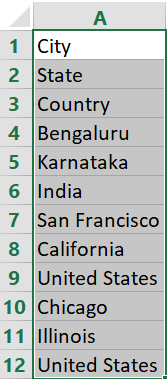
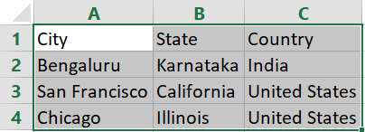

# arrange_data
 This script will tranform the single columnar data into multiple columns

If your row-wise data is in a single column then you can transform the data into proper row and column wise.

The repo is having sample files(sample.csv as input and sample_out.csv as output) as an example.

The usage of the script can be easily understood by

##### Sample Input Given

##### Output Achived from the Input

